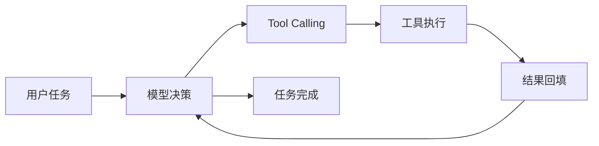

---

title: 快速开始
description: 安装并运行 MyCode，完成第一次 Coding Agent 任务。
------------------------------------------------

# 快速开始

<Badge type="tip" text="PyPI" />
<Badge type="info" text="Python 3.11+" />
<Badge type="warning" text="Personal Project" />

MyCode 是一个使用 Python 实现的终端 Coding Agent。它以启动命令时的当前目录作为 Workspace（工作区），通过 OpenAI-compatible Chat Completions 模型完成代码检索、文件修改、命令执行和调试验证。

这一页只解决一件事：

> **把 MyCode 跑起来，并完成第一次真实的 Coding Agent 任务。**

如果你更关心 Agent Runtime、Tool Calling、Context、SubAgent、MCP 等内部机制，可以直接进入 [项目总览](/01-overview/)。

## 环境要求

运行 MyCode 需要：

* Python 3.11 或更高版本
* [uv](https://docs.astral.sh/uv/)
* 一个支持 OpenAI-compatible Chat Completions 的模型服务
* 对应模型服务的 API Key

MyCode 当前主要在 **Windows + PowerShell** 环境下进行开发和验证。

## 安装

MyCode 已发布到 PyPI，可以直接通过 `uv` 安装：

```powershell
uv tool install mycode-coding-agent
```

安装完成后检查 CLI：

```powershell
mycode --help
```

如果能够正常显示 `agent`、`chat`、`tui`、`runtime` 等命令，即表示安装成功。

项目的 PyPI 页面：

[mycode-coding-agent on PyPI](https://pypi.org/project/mycode-coding-agent/)

## 配置模型

MyCode 使用 OpenAI-compatible Chat Completions 接口。

最少需要配置三个参数：

```dotenv
MYCODE_API_KEY=your-api-key
MYCODE_BASE_URL=https://your-provider.example/v1
MYCODE_MODEL=your-chat-completions-model
```

推荐把通用配置放在用户目录：

```text
%USERPROFILE%\.mycode\.env
```

也可以针对某个项目提供独立配置：

```text
<workspace>\.mycode\.env
```

配置优先级为：

```text
process environment
        ↓
project .mycode/.env
        ↓
user .mycode/.env
        ↓
defaults
```

项目级配置只需要填写需要覆盖的字段。

> MyCode 不读取项目根目录普通的 `.env` 文件。API Key 等敏感信息也不应该提交到 Git。

<details>
<summary>更多可选模型配置</summary>

除了主模型之外，MyCode 还可以单独配置 Compact 和 SubAgent 使用的模型：

```dotenv
MYCODE_COMPACT_MODEL=
MYCODE_SUBAGENT_MODEL=
```

Context Budget（上下文预算）相关配置：

```dotenv
LLM_CONTEXT_WINDOW_TOKENS=128000
LLM_RESERVED_OUTPUT_TOKENS=8192
LLM_CONTEXT_SAFETY_MARGIN_TOKENS=4096
LLM_MEMORY_CONTEXT_TOKENS=2048
```

部分 Provider 还可以根据实际协议支持情况配置：

```dotenv
LLM_THINKING_ENABLED=
LLM_REASONING_EFFORT=
LLM_MAX_OUTPUT_TOKENS=
```

这些参数不是第一次运行 MyCode 的必要条件，后续会在 Context / Runtime 相关章节中进一步讨论。

</details>

## 启动第一个 Agent

MyCode **没有单独的 `--workspace PATH` 参数**。

启动命令时所在的当前目录，就是 Agent 的 Workspace。

因此先进入一个你准备让 Agent 操作的 Git 项目：

```powershell
cd D:\path\to\your-project
```

然后启动：

```powershell
mycode agent
```

可以尝试一个简单但真实的任务，例如：

```text
阅读这个项目，找到当前失败的测试，分析原因并修复它，最后运行相关测试验证修改。
```

接下来 MyCode 会进入 Agent Loop：



模型可以根据当前任务调用文件读取、搜索、修改和命令执行等工具，并根据 ToolResult（工具结果）继续决定下一步行动。

## 会话

MyCode 会保存项目会话。

常用启动方式：

| 命令                                 | 作用                        |
| ---------------------------------- | ------------------------- |
| `mycode agent`                     | 正常启动，存在历史会话时显示 Session 菜单 |
| `mycode agent --new`               | 直接创建新 Session             |
| `mycode agent --continue`          | 继续当前项目最近使用的 Session       |
| `mycode agent --resume SESSION_ID` | 恢复指定 Session              |

交互过程中还可以使用：

```text
/help
/new
/sessions
/resume <session_id>
/context
/compact
/exit
```

Session、项目 Memory 和相关运行状态保存在用户目录下的 `.mycode` 中，并按照 Workspace 路径隔离不同项目。

## 其他入口

CLI Agent 是 MyCode 最直接的运行方式，但不是唯一入口。

### TUI

MyCode 提供基于 Textual 的终端界面：

```powershell
mycode tui
```

### 普通 Chat

如果只需要模型对话、不需要 Coding Tools：

```powershell
mycode chat
```

### Machine Runtime

MyCode 还提供机器可消费的 JSONL Runtime：

```powershell
mycode runtime --jsonl
```

它主要用于 Web、自动化程序或其他上层应用驱动 MyCode Core，而不是普通用户的主要交互入口。

## Web Demo

不安装本地环境也可以直接体验 Web Demo：

[打开 MyCode Web Demo](https://mycode.icu/web/)

Web 并没有重新实现另一套 Agent，而是通过 JSONL Machine Runtime 驱动同一个 MyCode Core。

这一部分的架构会在 [项目总览](/01-overview/) 中继续介绍。

## 从源码运行

<details>
<summary>查看源码安装方式</summary>

克隆仓库：

```powershell
git clone https://github.com/mmc-cloud/mycode.git
cd mycode
```

安装依赖：

```powershell
uv sync
```

直接运行：

```powershell
uv run mycode agent
```

运行测试：

```powershell
uv run pytest
```

如果希望把当前源码 checkout 安装成全局命令：

```powershell
uv tool install .
```

</details>

## 使用前需要知道的事

MyCode 能够修改文件并执行命令。

当前项目的 Permission、Workspace Boundary（工作区边界）和命令风险分类可以限制一部分危险操作，但这些机制并不能替代系统级 Sandbox。

建议：

1. 在已经使用 Git 管理的项目中运行；
2. 执行任务前提交或保存重要修改；
3. 确认当前目录就是准备让 Agent 操作的 Workspace；
4. Agent 完成后检查：

```powershell
git status
git diff
```

MyCode 当前是一个 **Coding Agent 个人工程实践项目**，并不是经过生产环境大规模验证的成熟开发工具。

## 下一步

成功运行 MyCode 后，推荐从 [项目总览](/01-overview/) 开始阅读整套文档。

接下来的重点不再是“怎么使用 MyCode”，而是：

> **一个 Coding Agent 到底由哪些部分组成，MyCode 又是怎样一步一步把这些机制实现出来的？**

→ [进入项目总览](/01-overview/)
