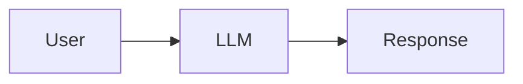
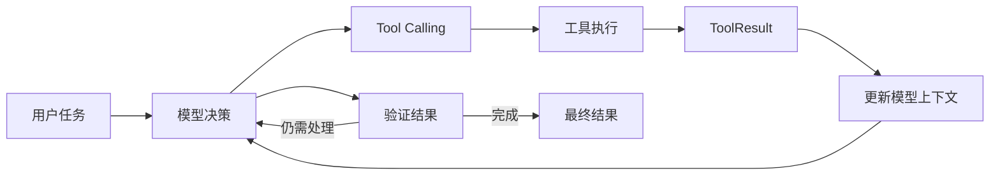
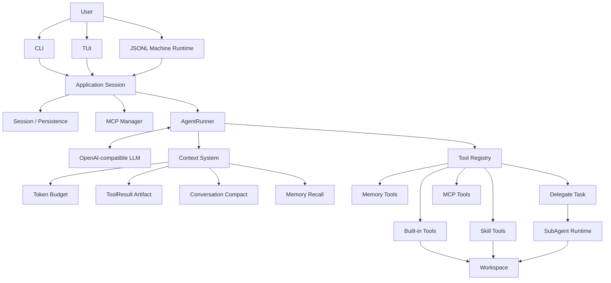
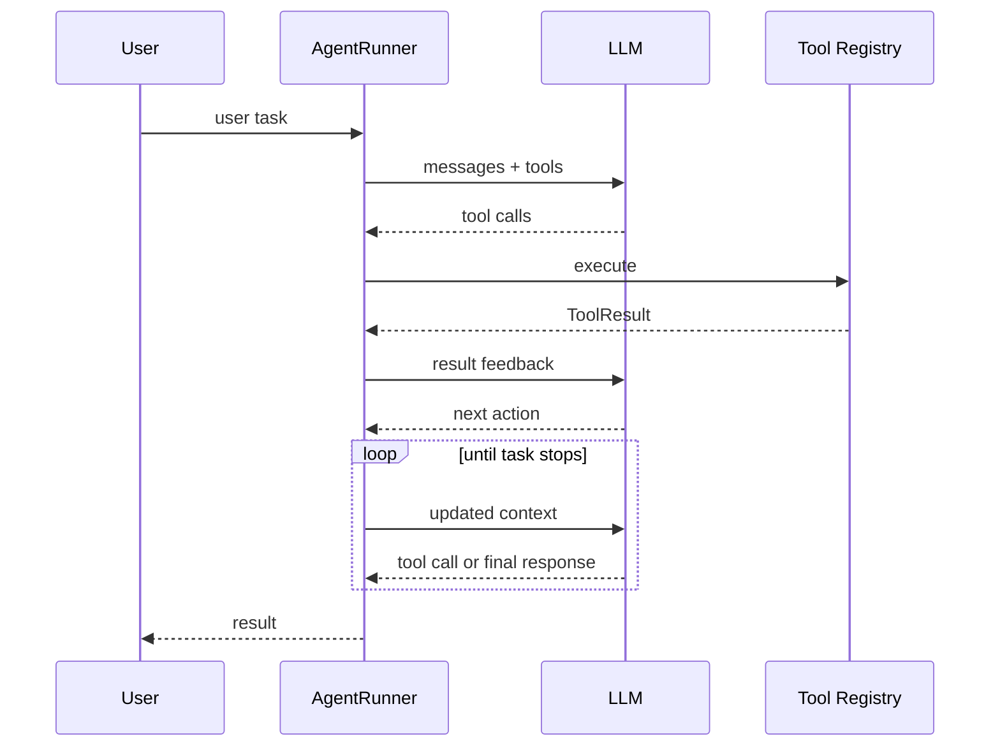
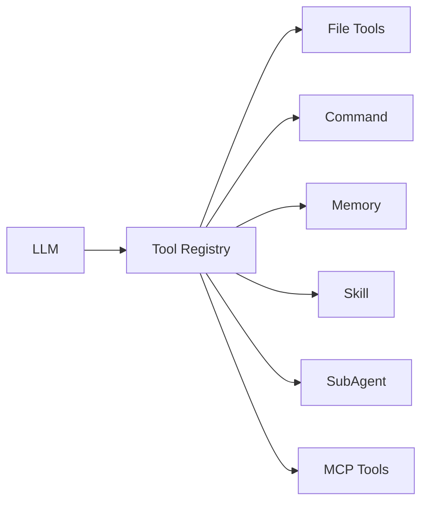
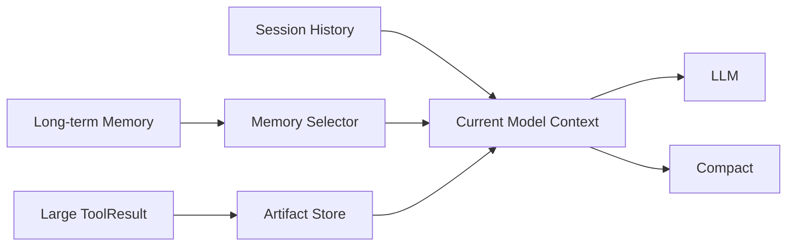
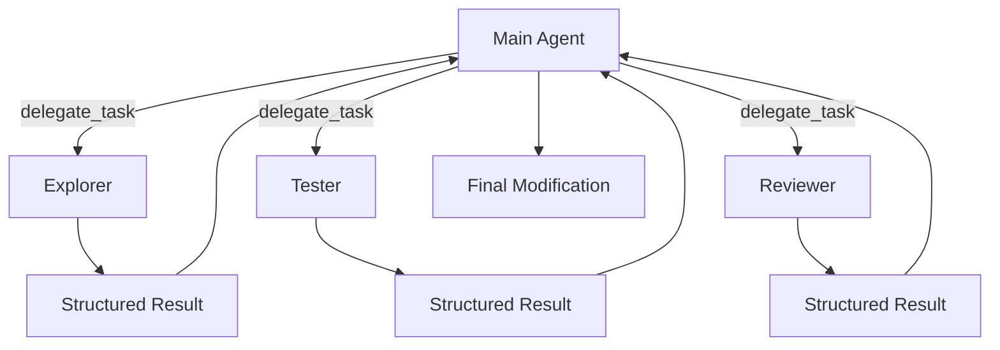
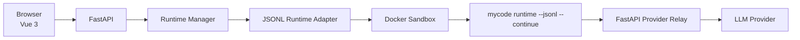
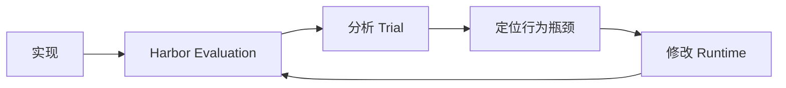
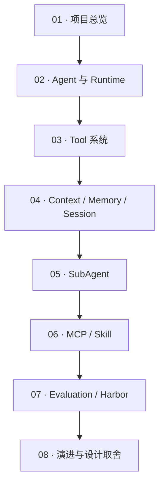

---

title: 项目总览
description: 从整体架构出发理解 MyCode，以及一个 Coding Agent 需要解决的核心工程问题。
------------------------------------------------------------

# 项目总览

<Badge type="tip" text="Coding Agent" />
<Badge type="info" text="Engineering Practice" />
<Badge type="warning" text="Personal Project" />

MyCode 是一个使用 Python 实现的 **Coding Agent 个人工程实践项目**。

它不是为了快速包装一个聊天界面，也不是以构建成熟商业产品为目标，而是围绕 Coding Agent 的核心机制，从 Agent Loop、Tool Calling 开始，逐步实现 Context、Memory、Session、SubAgent、MCP、Skill、Permission、Web Runtime 与 Evaluation。

项目最终形成了一个真实可运行的 Coding Agent：

* Core 可以作为终端程序独立运行；
* 已作为 Python Package 发布到 PyPI；
* 提供公开 GitHub 仓库；
* 提供可在线体验的 Web Demo；
* 建立了基于 Harbor 的回归评测与迭代流程。

这套文档记录的重点也因此不是“产品功能说明”，而是：

> **Coding Agent 面临什么工程问题，MyCode 为什么这样设计，以及这些设计在实际实现和评测中发生了怎样的演进。**

## 从 Chat 到 Coding Agent

普通的 LLM 应用可以非常简单：



但 Coding Agent 的目标不是只生成一段回答。

用户可能要求：

```text
修复这个失败的测试，并验证修改结果。
```

模型必须先理解项目，再读取文件、搜索代码、形成判断、修改文件、执行测试，并根据新的执行结果继续行动。

它更接近一个持续运行的闭环：



这意味着真正需要实现的已经不只是一次 LLM API 请求，而是一套 Agent Runtime。

## MyCode 要解决什么

实现一个可以真正修改代码的 Agent，会很快遇到一系列工程问题。

### Agent 如何持续行动

模型一次响应可能不是最终答案，而是：

```text
先读取文件
→ 再搜索引用
→ 修改代码
→ 运行测试
→ 根据失败结果继续修改
```

因此需要 Agent Loop 持续处理：

```text
模型决策
→ Tool Call
→ ToolResult
→ 再次决策
```

同时 Runtime 还必须处理最大轮次、重复行为、验证状态以及任务结束条件。

### 工具如何安全执行

模型不能直接获得任意 Python 函数和操作系统能力。

工具层需要解决：

* Tool Schema 如何定义；
* 参数如何校验；
* Tool Call 与 ToolResult 如何配对；
* 哪些工具能够并行；
* 哪些操作必须串行；
* 文件访问如何限制在 Workspace；
* 高风险操作什么时候需要人工确认。

### Context 为什么会越来越大

Coding Agent 会不断产生：

* 用户消息
* 模型输出
* Tool Call
* 文件内容
* 搜索结果
* 命令输出
* 测试日志

如果全部长期保留在模型上下文中，Context Window 很快就会成为新的资源限制。

因此需要进一步解决：

* Token Budget
* ToolResult Retention
* Artifact 外部化
* Conversation Compact
* Memory Recall

### 一次任务和长期状态有什么区别

Coding Agent 中至少存在几种不同的状态：

```text
当前 Turn
当前 Session
当前 Project
跨 Session Memory
```

它们的生命周期并不相同。

会话应该可以继续和恢复，但临时运行状态不应该被错误持久化；长期 Memory 又不能简单等同于完整历史对话。

### 一个 Agent 是否应该完成所有工作

代码探索、测试和 Review 等任务有时彼此独立。

因此 MyCode 又引入了 SubAgent：

```text
Main Agent
   │
   ├── Explorer
   ├── Tester
   └── Reviewer
```

每个 SubAgent 拥有独立 Context 和受限 Tool Set，最终由 Main Agent 汇总结果并负责主要修改。

### Agent 如何扩展新能力

如果每加入一种外部能力都修改 Core，系统会越来越耦合。

因此 MyCode 又实现了两种扩展机制：

* **Skill**：向 Agent 提供可复用的任务方法、参考资源和受控脚本；
* **MCP**：连接独立 MCP Server，把外部 Tool 动态接入现有 Tool Registry。

### 怎么知道一次修改真的让 Agent 变好了

Agent Demo 成功一次，并不能说明 Agent 能力真的提升。

因此项目后期又增加 Evaluation：

```text
实现
 ↓
固定回归任务
 ↓
重复运行
 ↓
分析失败 Trial / Tool Trajectory
 ↓
定位行为瓶颈
 ↓
修改 Runtime
 ↓
重新评测
```

这也是 MyCode 后期开发方式发生的重要变化：

**从“增加功能”，逐渐转向“观察 Agent 行为并通过 Evaluation 驱动 Runtime 迭代”。**

## 整体架构

从代码结构看，MyCode Core 并不是把所有逻辑都塞进一个 Agent 类。

应用层负责把 Session、Runtime、MCP 等能力组装起来；AgentRunner 负责主要 Agent Loop；Tool、Context、Memory、SubAgent 等能力则作为不同模块参与运行。



这张图最重要的不是每一条连线，而是几个边界：

**LLM 负责决策。**

**AgentRunner 负责维持 Agent Loop。**

**Tool Registry 负责统一工具执行入口。**

**Context System 负责有限模型窗口中的信息管理。**

**Application / Session 层负责把一次 Agent 运行放进可以恢复和持久化的生命周期中。**

## Agent Runtime

MyCode 主 Agent 的核心运行对象是 `AgentRunner`。

它接收用户任务，然后持续完成：



这里有一个贯穿整个 MyCode 设计的重要边界：

> **Runtime 不应该替模型写死具体任务步骤，但 Runtime 必须控制协议、安全、资源和生命周期。**

模型决定：

```text
下一步要读什么？
要改什么？
要运行什么？
是否还需要继续调查？
```

Runtime 则负责：

```text
这个 Tool Call 是否合法？
是否需要 Permission？
工具怎样调度？
Context 是否还能容纳？
是否出现重复或停滞？
修改之后是否进行了有效验证？
什么时候必须结束循环？
```

后面的 [Agent 与 Runtime](/02-agent/) 会专门拆解这一部分。

## Tool System

MyCode 的默认 Coding Tools 包括：

```text
read_file
glob
grep
write_file
edit_file
run_command
```

Memory、Skill、Artifact、SubAgent 和 MCP 等能力也可以继续向同一个 Registry 注册工具。

因此模型最终看到的不是几套互不相关的执行机制，而是统一的 Tool Calling 接口：



Tool Registry 不只是一个函数表。

它还承担了：

* Schema
* 参数验证
* Permission
* Tool Dispatch
* ToolResult
* Scoped Approval

等执行职责。

详细设计见 [Tool 系统](/03-tools/)。

## Context、Memory 与 Session

这三个概念容易混在一起，但在 MyCode 中承担不同职责。

### Context

Context 是：

> **当前这一轮真正发送给模型的信息。**

它受到模型 Context Window 限制，因此需要 Token Budget、ToolResult 压缩、Artifact 和 Compact。

### Session

Session 是：

> **一次可以持续、退出并恢复的 Agent 会话。**

完整历史并不等于每一轮都全部发送给模型。

Session Persistence（会话持久化）负责保存对话和 Compact 等状态，而 Context Builder 决定当前模型真正看到什么。

### Memory

Memory 是：

> **跨对话仍然值得保留的项目或用户级长期信息。**

Memory 会经过选择和 Token Budget 控制后重新进入当前 Context，而不是把历史 Session 原样重新塞给模型。

可以把三者理解为：



详细内容见 [Context / Memory / Session](/04-context/)。

## SubAgent

MyCode 采用的是 Manager / Agent-as-tool 模式。

Main Agent 可以通过 `delegate_task` 把适合独立处理的工作委派给 SubAgent。

当前主要角色包括：

* Explorer：代码调查与定位；
* Tester：测试和验证；
* Reviewer：审查与风险发现。

结构上更接近：



SubAgent 不是简单复制 Main Agent。

它具有独立上下文、角色 Prompt 和受限工具集合，同时存在委派深度限制，避免递归产生无限 Agent。

详见 [SubAgent](/05-subagent/)。

## MCP 与 Skill

MCP 和 Skill 都是扩展机制，但解决的问题不同。

### MCP

MCP 解决：

> **Agent 如何连接外部工具。**

MyCode 当前作为 MCP Client，支持：

```text
stdio
Streamable HTTP
```

MCP Server 动态发现的 Tool 会被包装成 MyCode Tool，并最终注册进入现有 Tool Registry。

因此 MCP Tool 仍然复用 MyCode 已有的：

```text
Schema
Permission
Confirmation
ToolResult
```

执行链路。

### Skill

Skill 解决：

> **Agent 如何按需获得一套可复用的任务方法、知识和资源。**

Skill 不会在启动时把所有内容完整塞进 Context。

Agent 可以先看到 Skill Catalog，需要时再通过工具加载 Skill 正文、读取资源或运行受控脚本。

这是 Progressive Disclosure（渐进式披露）思路在 Agent Context 中的一种实践。

详细内容见 [MCP / Skill](/06-mcp-skill/)。

## Web 为什么独立于 Core

MyCode Web 是一个独立仓库。

它没有重新实现一套 Agent，也不直接复制 MyCode Python Package。

Web 通过 Core 提供的 JSONL Machine Runtime 驱动同一个 MyCode：



这样的拆分让 Core 和 Presentation Layer（展示层）保持相对独立：

```text
CLI ─────┐
TUI ─────┼──> MyCode Core
Web ─────┘
```

Web 负责：

* Browser UI
* Workspace
* Multi-session
* SSE
* Permission Interaction
* Runtime Pool
* Sandbox 生命周期
* Provider Relay

真正的 Agent Loop、Tool、Context、Memory、Skill、MCP 和 SubAgent 仍然属于 Core。

在线 Demo：

https://mycode.icu/web/

## Evaluation

Coding Agent 很容易出现一种错觉：

> 某个 Demo 成功了，所以这次 Runtime 修改一定更好。

实际并不是这样。

模型行为具有随机性，一项修改可能：

* 改善一类任务；
* 恶化另一类任务；
* 减少重复调查；
* 却增加错误终止；
* 单次表现很好；
* 重复运行后却不稳定。

因此 MyCode 建立了基于 Harbor 的固定回归评测流程，并维护专门的 Harbor Adapter 和评测工程。

关注的不只是最终 Pass / Fail，还包括运行轨迹中的问题，例如：

```text
重复工具调用
重复资源调查
修改后没有有效验证
Context 资源消耗
Agent Loop 停滞
错误完成
达到最大轮次
```

迭代方式逐渐变成：



Evaluation 因此不是项目完成之后额外添加的一项测试，而逐渐成为 MyCode Runtime 设计的重要反馈环。

详见 [Evaluation / Harbor](/07-evaluation/)。

## 一个真正跑起来的个人项目

MyCode 的目标不是证明“已经做出了一个成熟 Coding Agent 产品”。

目前它没有大规模用户，也没有经过生产环境的大规模验证。

这个项目更希望证明另一件事：

> **Coding Agent 的核心问题不只是调用一个大模型，而是一整套 Runtime、Tool、Context、Safety、Persistence、Extension 和 Evaluation 工程。**

目前已经形成几种可以实际验证项目的交付形态：

| 形态                | 作用                  |
| ----------------- | ------------------- |
| GitHub            | 查看公开 Core 源码        |
| PyPI              | 安装真实 Python Package |
| CLI / TUI         | 本地直接运行 Agent        |
| Web Demo          | 在线体验同一个 Core        |
| Harbor Evaluation | 对 Agent 行为进行固定回归评测  |
| Docs              | 记录架构、实现和设计演进        |

项目地址：

* [MyCode Core · GitHub](https://github.com/mmc-cloud/mycode)
* [MyCode Web · GitHub](https://github.com/mmc-cloud/mycode-web)
* [mycode-coding-agent · PyPI](https://pypi.org/project/mycode-coding-agent/)
* [MyCode Web Demo](https://mycode.icu/web/)

## 项目边界

MyCode 当前仍然是一个个人工程实践项目。

它主要关注：

* Coding Agent 核心机制；
* Runtime 行为；
* Tool Calling；
* Context 管理；
* Permission 与风险边界；
* Session / Memory；
* SubAgent；
* MCP / Skill；
* Evaluation 驱动的迭代。

当前并不重点解决：

* 大规模用户和租户体系；
* 企业级权限治理；
* 高可用与 SLA；
* 多机 Runtime 调度；
* 商业化能力；
* IDE 生态；
* 极致的产品 UX。

此外，当前主要实际验证环境仍然是 Windows + PowerShell；不同 OpenAI-compatible Provider 在 Streaming、Usage、Thinking 和 Reasoning 字段上的协议兼容性也存在差异。

这些限制并不是文档需要隐藏的内容。

相反，它们定义了这个项目当前真实的工程边界。

## 如何阅读这套文档

如果第一次接触 MyCode，推荐按照下面的顺序：



### 想理解 Coding Agent 最核心的循环

→ [Agent 与 Runtime](/02-agent/)

### 想理解 LLM 如何真正操作代码和命令

→ [Tool 系统](/03-tools/)

### 想理解长任务中的 Context、长期 Memory 和 Session

→ [Context / Memory / Session](/04-context/)

### 想理解 Multi-Agent

→ [SubAgent](/05-subagent/)

### 想理解能力扩展

→ [MCP / Skill](/06-mcp-skill/)

### 想理解如何判断 Agent 是否真的变好

→ [Evaluation / Harbor](/07-evaluation/)

### 想看项目为什么一步一步演变成现在这样

→ [MyCode 演进与设计取舍](/08-evolution/)

---

MyCode 的实现并不是一次性设计完成的。

很多 Runtime 策略都经历过：

```text
发现问题
→ 提出方案
→ 实现
→ Harbor 回归
→ 分析失败轨迹
→ 保留、修改或删除
```

因此最后一章不会只记录“现在是什么样”，还会讨论：

> **哪些设计曾经看起来合理，却在真实 Agent 行为中暴露了问题，以及为什么最终选择了现在的方案。**
