---

title: Agent 与 Runtime
description: 从 Agent Loop 出发，拆解 MyCode 如何让模型持续决策、调用工具并在 Runtime 约束下完成 Coding Task。
----------------------------------------------------------------------------------

# Agent 与 Runtime

<Badge type="tip" text="Agent Loop" />
<Badge type="info" text="Runtime" />
<Badge type="info" text="ReAct" />

Coding Agent 和普通 LLM Chat 最核心的区别，不是 Prompt 更复杂，而是：

> **模型的输出可以变成真实动作，动作产生的新结果又会重新进入模型上下文。**

于是一次请求不再是简单的：

```text
User → LLM → Response
```

而变成一个持续运行的闭环：

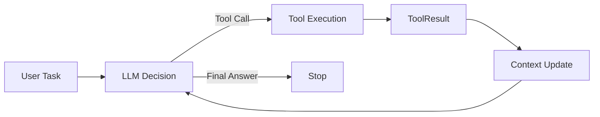

MyCode 的 `AgentRunner` 就是这个循环的核心 Runtime。

这一章先从最小 Agent Loop 开始，再逐步拆解：

* Agent 到底是什么；
* ReAct 与 Tool Calling 的关系；
* Agent Loop 如何运行；
* Runtime 应该控制什么；
* Tool Batch 如何执行；
* Progress / Stagnation 如何观察；
* Context、Permission、Session 等能力如何进入 Agent；
* MyCode 为什么没有把所有决策都写死在 Runtime 中。

---

## 1. 从 LLM 到 Agent

普通 LLM 调用的基本形式是：

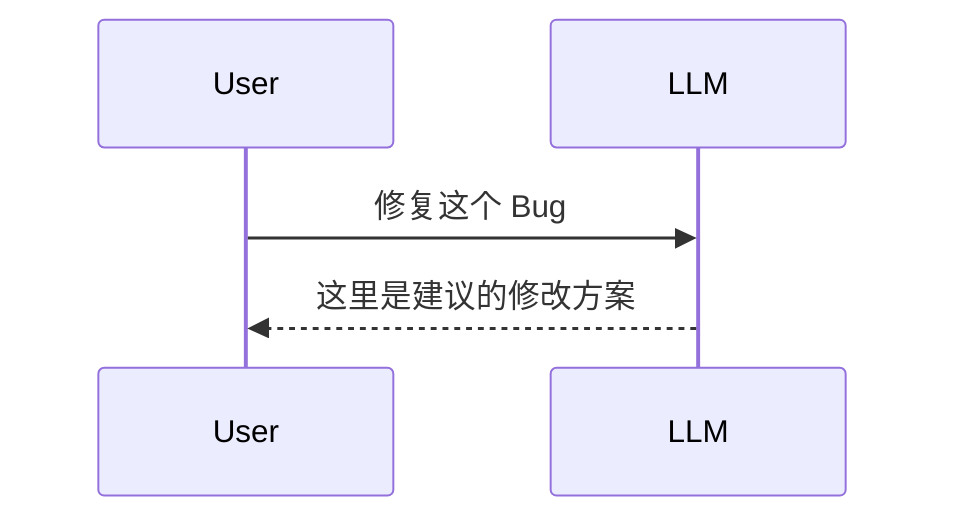

模型能“告诉你怎么做”，但它本身没有真正操作项目。

Coding Agent 则需要把一部分环境能力提供给模型：

```text
read_file
glob
grep
write_file
edit_file
run_command
...
```

此时模型的响应可能不再是自然语言答案，而是：

```text
read_file("src/parser.py")
```

Runtime 执行工具以后得到：

```text
ToolResult:
...
```

然后再把这个结果提供给模型。

模型继续判断：

```text
读取 tests/test_parser.py
```

接着可能：

```text
edit_file(...)
```

最后：

```text
run_command(["pytest", "tests/test_parser.py", "-q"])
```

因此 Agent 最基本的结构其实可以概括为：

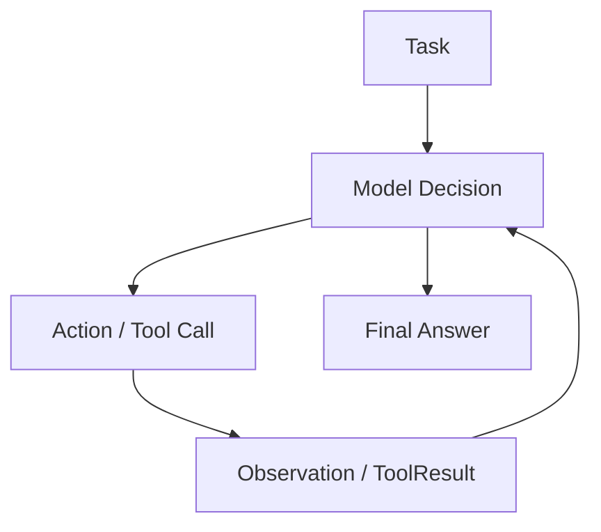

这就是一个最小的 **Agent Loop（Agent 循环）**。

---

## 2. ReAct：Reasoning + Acting

理解 Coding Agent 时经常会遇到 ReAct。

ReAct 可以简单理解为：

```text
Reasoning
    ↓
Action
    ↓
Observation
    ↓
Reasoning
    ↓
...
```

即模型不是一次性生成完整方案，而是：

1. 根据当前信息判断下一步；
2. 执行动作；
3. 获取新的环境信息；
4. 根据真实结果重新判断。

例如：

```text
用户：
修复当前失败的测试。

Agent：
需要先看看有哪些测试失败。

Action:
run_command(["pytest", "-q"])

Observation:
2 failed, 18 passed

Agent：
失败集中在 parser，先查看对应测试。

Action:
read_file("tests/test_parser.py")

Observation:
...

Agent：
再读取实现。

Action:
read_file("src/parser.py")

Observation:
...

Agent：
发现 empty input 分支错误，修改代码。

Action:
edit_file(...)

Observation:
修改成功

Agent：
重新运行相关测试。

Action:
run_command(["pytest", "tests/test_parser.py", "-q"])

Observation:
8 passed

Agent：
任务完成。
```

真正重要的是：

> **Agent 不需要在第一步就知道整个任务应该怎样完成。**

它可以通过与环境交互逐步获得信息。

这也是 Coding Agent 比固定 Workflow 更适合处理开放式代码任务的原因之一。

---

## 3. Workflow 和 Agent 的区别

固定 Workflow 更像：

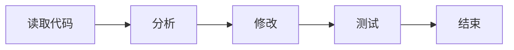

流程是开发者提前规定好的。

但真实 Coding Task 很难固定：

```text
任务 A：
搜索 → 读文件 → 修改 → 测试

任务 B：
运行测试 → 搜错误 → 读配置 → 修改两个文件 → 再测试

任务 C：
读代码 → 调查依赖 → 委派 SubAgent → 修改 → lint → test

任务 D：
读文件 → 发现不需要修改 → 直接解释
```

所以 MyCode 并没有把 Agent 写成：

```python
read()
analyze()
edit()
test()
finish()
```

而是让模型动态决定下一步 Tool Call。

Runtime 管理的是**循环本身**，而不是具体业务步骤。

---

## 4. MyCode 的核心 Agent Loop

MyCode 当前主循环位于：

```text
mycode/agent/runner.py
```

核心对象：

```python
AgentRunner
```

对外的主要执行入口是：

```python
AgentRunner.run(user_message)
```

它返回的是一个 `Iterator[AgentEvent]`。

也就是说，Agent 运行过程中并不是最后一次性返回所有结果，而是持续产生事件：

```text
turn
model_start
text_delta
tool_call
tool_result
progress
...
stop
```

因此 CLI、TUI、JSONL Runtime 等不同 Presentation Layer 都可以消费同一套 Agent 事件。

整体流程可以概括为：

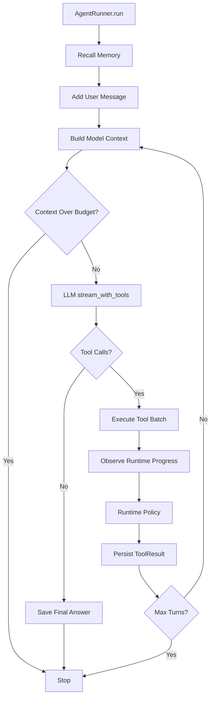

这就是 MyCode Agent Runtime 最核心的骨架。

---

## 5. 一轮 Turn 发生了什么

一次 Agent Run 可以包含很多个 Turn。

假设：

```text
max_turns = 50
```

Runtime 会不断：

```python
for turn_index in range(self.max_turns):
```

每一轮主要经历以下阶段。

### 5.1 构建当前 Context

Runtime 先准备：

```text
System Prompt
Conversation
Memory
Tool Results
Compact Summary
Runtime Guidance
Tool Schemas
```

然后根据 Context Budget 构造真正发送给模型的消息。

这里需要区分：

```text
Conversation History
        ≠
Current Model Context
```

历史记录可能很多，但这一轮真正能发送给模型的信息受到 Context Window 限制。

Context 的具体处理会在 [Context / Memory / Session](/04-context/) 单独讨论。

---

### 5.2 把 Tool Schema 提供给模型

Runtime 从：

```text
ToolRegistry
```

获取当前可用工具 Schema。

因此模型当前能调用什么，不是单纯写死在 System Prompt 中，而取决于 Registry 中实际注册了什么 Tool。

例如基础 Agent 可能具有：

```text
read_file
glob
grep
write_file
edit_file
run_command
```

另外还可能动态加入：

```text
Memory Tools
Skill Tools
read_artifact
delegate_task
MCP Tools
```

之后 Runtime 调用模型：

```text
LLM + Messages + Tool Schemas
```

---

### 5.3 模型返回两类主要结果

从 Agent Runtime 的角度，模型这一轮最重要的结果只有两种。

#### 返回 Tool Call

例如：

```text
read_file(path="src/parser.py")
```

说明：

> 任务还没有结束，需要继续和环境交互。

Runtime 执行工具，再进入下一轮。

#### 返回普通文本且没有 Tool Call

例如：

```text
已经修复 parser 的 empty input 问题，并通过相关测试。
```

当前 MyCode 会把它视为：

```text
final_answer
```

然后结束本次 Agent Run。

因此：

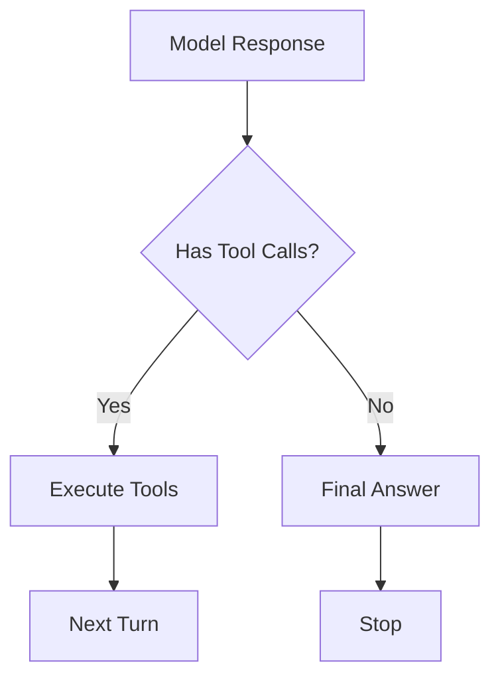

---

## 6. Tool Call 为什么必须经过 Runtime

如果让模型直接执行任意程序，会产生大量问题。

因此：

```text
LLM
 ↓
Tool Call
 ↓
Runtime
 ↓
Tool
```

而不是：

```text
LLM
 ↓
Operating System
```

Runtime 可以在中间执行：

```text
Schema Validation
Permission Check
Workspace Boundary
Risk Classification
Concurrency Scheduling
ToolResult Normalization
```

这也是 Tool System 独立存在的原因。

后面的 [Tool 系统](/03-tools/) 会详细拆这一层。

---

## 7. 一次响应可以调用多个 Tool

模型不一定一次只产生一个 Tool Call。

例如为了调查项目：

```text
read_file("src/a.py")
read_file("src/b.py")
read_file("tests/test_a.py")
```

如果这些工具彼此没有副作用，完全串行执行会浪费时间。

因此 MyCode 的 Tool Batch 支持：

```text
Concurrency Safe Tool
        ↓
并行执行

Non-Concurrency-Safe Tool
        ↓
串行执行
```

当前每组并发安全 Tool 最多同时执行：

```text
4
```

而模型单次响应中的 Tool Call 总数量也存在上限。

结构上可以理解为：

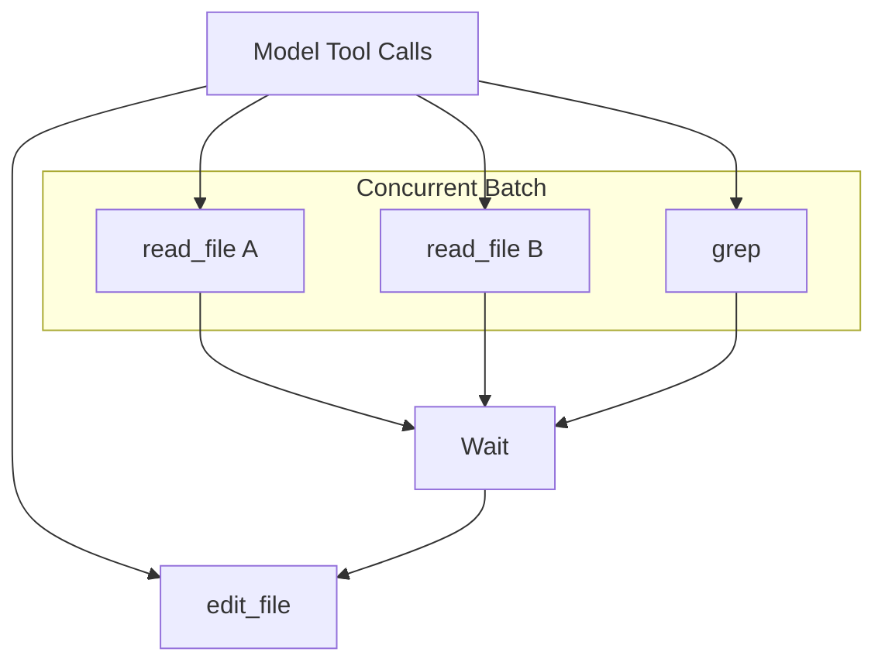

为什么不能所有工具都直接并发？

因为：

```text
read A
read B
grep C
```

通常互不影响。

但：

```text
edit_file A
edit_file A
run_command
```

则可能存在顺序和副作用问题。

所以 Tool 本身需要声明自己的并发安全语义，由 Runtime 负责调度。

---

## 8. ToolResult 如何重新进入循环

执行 Tool 以后，会生成统一的：

```text
ToolResult
```

例如：

```text
ok
content
error
metadata
```

Runtime 把结果写入 Conversation，使下一轮模型能够观察真实执行结果。

于是形成完整闭环：

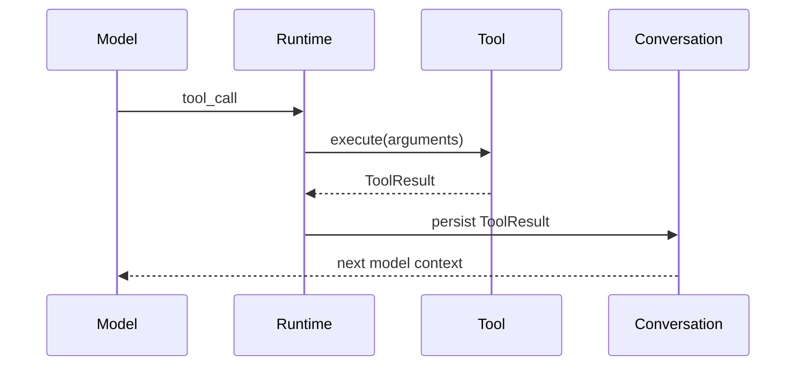

这一步非常关键。

如果 ToolResult 不重新回填给模型，那么模型只是“发出了命令”，并不知道命令到底发生了什么。

---

## 9. Runtime 到底应该控制什么

Coding Agent 设计里很容易走向两个极端。

### 极端一：Runtime 什么都不管

```text
模型想做什么就做什么。
```

问题是容易出现：

* 无限循环；
* 重复读同一个文件；
* 重复执行同一个命令；
* Context 爆炸；
* 危险命令直接执行；
* Tool 协议错误；
* 长时间无法收敛。

### 极端二：Runtime 管得太多

例如 Runtime 强制规定：

```text
必须先调查 8 次
必须再修改
必须验证 2 次
必须进入某个 Phase
必须按照固定顺序执行
```

这样又会逐渐退化成 Workflow。

模型无法根据任务本身灵活决策。

MyCode 更希望维持这样的边界：

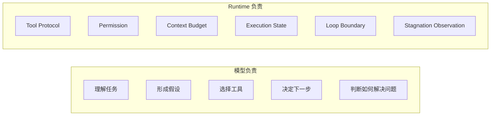

也就是：

> **Runtime 管约束和资源，不替模型完成任务规划。**

---

## 10. Progress：Runtime 如何观察 Agent

Runtime 如果完全不理解工具执行发生了什么，就无法判断 Agent 是否陷入异常行为。

但 Runtime 同样不应该试图“理解代码语义”。

因此 MyCode 使用的是相对轻量的 Runtime Observation。

一次 Tool 执行后，可以观察：

```text
tool_result
tool_signature
resource
mutation
validation
result_signature
```

例如：

```text
edit_file("src/a.py")
```

可能被识别为：

```text
mutation = yes
resource = file:src/a.py
```

而：

```text
pytest tests/test_a.py
```

如果能够识别为验证命令并获得退出码，则可以形成：

```text
validation = pass
```

或：

```text
validation = fail
```

这里的重点是：

> Runtime 记录的是**事实信号**，而不是直接替模型判断“任务已经完成”。

---

## 11. 为什么区分 Observation 和 Policy

这是 Runtime 设计里一个非常重要的思想。

例如 Runtime 观察到：

```text
同一个 Tool 重复调用
同一个 Result 重复出现
同一个 Resource 被反复调查
```

这是：

```text
Observation
```

但接下来怎么办属于：

```text
Policy
```

这两件事不应该混在一起。

MyCode 当前的结构是：

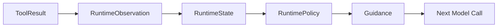

这样可以避免：

```text
检测逻辑
=
控制逻辑
```

紧紧耦合在一起。

---

## 12. Stagnation：Agent 为什么会重复调查

Coding Agent 很常见的一种失败不是直接报错，而是：

```text
read_file A
grep B
read_file A
grep B
read_file A
...
```

模型实际上没有获得新的有效信息，但仍持续消耗：

```text
Turn
Token
Time
Tool Call
```

MyCode 当前会观察三个维度：

```text
same_tool_repeat
same_result_repeat
resource_repeat
```

即：

### Tool 是否重复

例如连续：

```text
read_file(path="a.py")
read_file(path="a.py")
```

### ToolResult 是否重复

工具参数可能稍有变化，但实际返回信息没有变化。

### Resource 是否重复

例如不同形式的操作最终都集中在同一个文件范围。

如果重复模式持续形成停滞，Runtime 会产生：

```text
CONVERGENCE_GUIDANCE
```

提醒模型：

> 当前出现重复主导的停滞特征，请重新评估当前假设和路径。

注意这里 Runtime **没有告诉模型下一步必须调用什么工具**。

这是有意的。

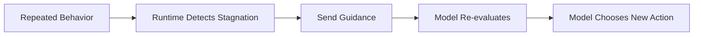

Runtime 负责：

```text
发现“你似乎卡住了”
```

而不是：

```text
直接命令“现在必须编辑这个文件”
```

---

## 13. 重复 Tool Call 的硬边界

除了软性的 Stagnation Guidance，Runtime 还存在更基础的保护：

```text
Repeated Tool Call Limit
```

如果模型持续生成相同的 Tool Call，可以触发停止保护。

这和 Stagnation Policy 的作用并不完全一样：

```text
Stagnation
→ 行为层面的软提示
→ 让模型重新评估

Repeated Tool Call Limit
→ Loop Safety Boundary
→ 防止明显的死循环
```

因此 Runtime 中可以同时存在：

```text
Soft Intervention
Hard Boundary
```

两类机制。

---

## 14. Validation 在当前 Runtime 中是什么

MyCode 能识别一部分 Validation Command。

例如：

```text
pytest
```

Runtime 可以根据：

```text
command
exit_code
```

形成：

```text
validation = pass
```

或者：

```text
validation = fail
```

但这里需要明确当前实现的边界：

> **Validation 当前首先是一种 Runtime Observation，而不是一个通用的最终完成硬门槛。**

也就是说 Runtime 能知道：

```text
发生过修改
发生过测试
测试成功 / 失败 / 未知
```

但当前公开实现并不会简单规定：

```text
if mutation:
    必须 validation == pass 才允许 final answer
```

这是一个有意值得继续讨论的 Agent Runtime 设计问题：

> Runtime 到底应该多大程度干预模型的完成判断？

过弱可能导致：

```text
修改以后没有验证就结束。
```

过强则可能导致：

```text
非代码修改任务也被强制测试；
无法识别的自定义验证被错误阻止；
Runtime 逐渐接管模型决策。
```

这也是 MyCode 演进过程中一直需要权衡的问题之一。

---

## 15. Context 也是 Runtime 的职责

Agent Loop 运行越久：

```text
Conversation
ToolResult
Command Output
File Content
Memory
```

都会不断增加。

所以每次真正调用模型之前，Runtime 都会构建：

```text
ModelContext
```

并检查 Context Budget。

如果已经超过模型可用范围，Runtime 不会继续盲目调用模型，而会以：

```text
context_overflow
```

停止。

Context 管理本身又涉及：

```text
Tool Result Retention
Artifact
Compact
Memory Recall
Token Budget
```

这一部分在 [Context / Memory / Session](/04-context/) 展开。

---

## 16. 为什么要有 Max Turns

Agent 理论上可以一直循环：

```text
Model
→ Tool
→ Model
→ Tool
→ ...
```

因此必须有明确的资源边界。

MyCode 当前主 Agent 默认存在最大 Turn 限制。

距离上限只剩少量 Turn 时，Runtime 会发送一次 Near-limit Guidance：

```text
剩余轮次已经不多，
优先完成最重要的必要步骤。
```

如果最终达到上限，Runtime 不会无限继续执行工具，而进入最终整理阶段。

如果任务仍未完成，可以生成用于后续继续执行的：

```text
续跑检查点
```

其中记录：

```text
已确认事实
已读取文件及范围
已修改文件
测试状态
剩余动作
当前阻塞
```

于是：

```text
达到 Max Turns
       ↓
生成 Checkpoint
       ↓
结束当前 Run
       ↓
用户继续
       ↓
从 Checkpoint 衔接
```

而不是下一轮完全从头重新调查。

---

## 17. 错误和 Retry

Agent Runtime 面对的不只是任务逻辑错误，还存在 Provider 层问题：

```text
timeout
rate limit
connection error
stream failure
empty response
```

因此 MyCode 在模型调用边界还存在 Retry。

部分可重试错误会：

```text
Model Request
    ↓
Retryable Error
    ↓
Backoff
    ↓
Retry
```

但 Retry 次数仍然有界。

另外，如果模型返回：

```text
没有 Tool Call
+
没有有效文本
```

Runtime 会额外提示一次模型继续任务或给出 Final Answer。

连续得到 Empty Response 后则终止为 Model Error。

这些都属于 Runtime 的职责：

> **模型可以做任务决策，但模型调用协议本身必须由程序保证可靠性。**

---

## 18. AgentRunner 不是整个 MyCode

虽然 `AgentRunner` 是 Agent Loop 的核心，但完整运行环境还需要 Application Layer。

MyCode 启动一个真实 Agent Session 时，会进一步装配：

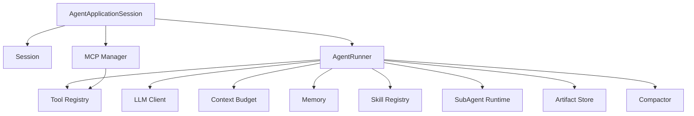

因此可以把 MyCode 分成两层来看。

### Agent Runtime

负责：

```text
Model ↔ Tool ↔ Result
```

这个持续循环。

### Application Runtime

负责：

```text
Session
Persistence
MCP lifecycle
Workspace
Agent assembly
```

以及一次 Agent 运行所需要的其他外围能力。

这种拆分也使 CLI、TUI 和 JSONL Runtime 不需要各自重新实现 Agent。

---

## 19. 一个 Coding Task 的完整路径

把目前讨论的内容放到一起，一个典型任务可以表示为：

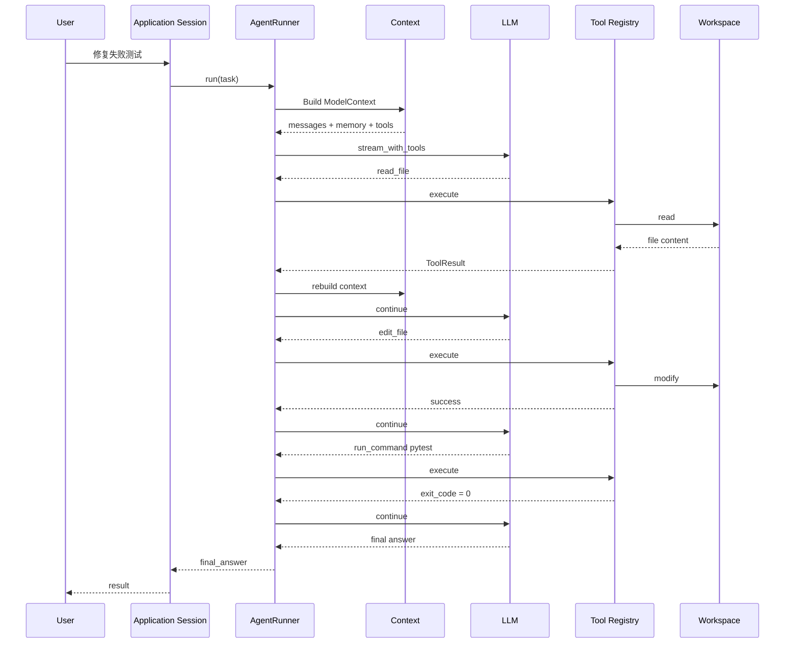

这就是 MyCode 最基础的 Coding Agent 工作方式。

后面的 Tool、Context、SubAgent、MCP 等模块，本质上都是在扩展或者保护这一条主循环。

---

## 20. 为什么 MyCode 选择“模型决策 + Runtime 约束”

MyCode 当前更倾向于：

```text
模型负责智能决策
+
Runtime 提供确定性约束
```

而不是试图用 Runtime 写出一个“更聪明的规则系统”。

原因是 Coding Task 的变化非常大。

Runtime 很适合确定：

```text
这个路径能不能访问
这个 Tool 参数是否合法
Context 有没有超预算
是否出现明显死循环
某些 Tool 是否可以并发
任务最多运行多少轮
```

但 Runtime 很难可靠决定：

```text
现在应该先读哪个文件
当前假设是否正确
这个 Bug 应该怎样修
应该写什么代码
下一步最有信息价值的调查是什么
```

后者正是模型存在的意义。

所以比较理想的边界是：

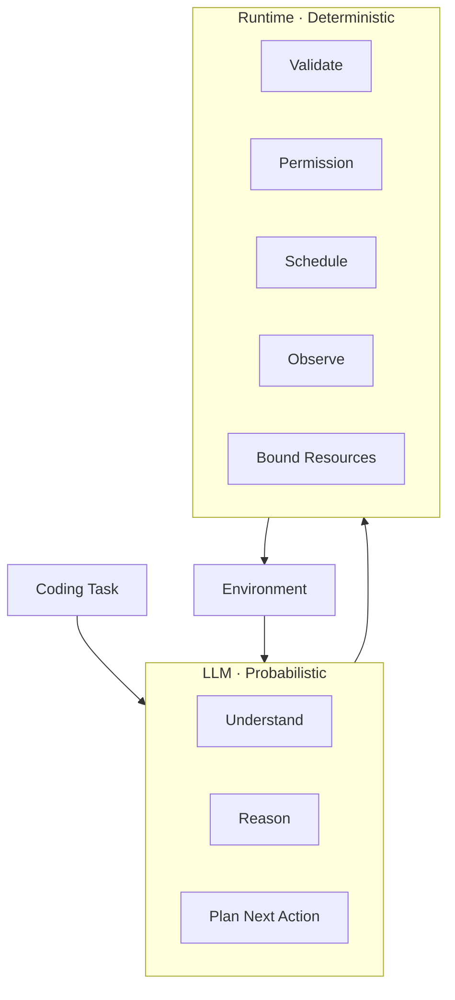

可以概括成一句话：

> **Agent 的能力主要来自模型，Agent 的可靠运行来自 Runtime。**

---

## 21. 这一章对应的源码

如果希望从源码继续阅读，可以重点看：

```text
mycode/
├─ agent/
│  ├─ runner.py       # Agent Loop / Tool Batch / Model 调用
│  ├─ progress.py     # Runtime Observation / Stagnation Policy
│  ├─ events.py       # AgentEvent
│  └─ outcome.py      # Agent Run Outcome
│
├─ application/
│  ├─ runtime.py      # AgentRunner 装配
│  └─ agent_session.py# Session + MCP + Runner 生命周期
│
├─ tools/
│  ├─ registry.py
│  └─ ...
│
└─ context/
   └─ ...
```

其中最核心的阅读顺序建议是：

```text
AgentRunner.run()
      ↓
execute_tool_batch()
      ↓
RuntimeObservation
      ↓
decide_runtime_policy()
      ↓
build_agent_runner()
      ↓
AgentApplicationSession
```

---

## 下一章

到这里，Agent Loop 本身已经建立起来。

但还有一个关键问题没有展开：

> 模型说 `read_file`、`edit_file`、`run_command` 时，程序究竟如何把一个 LLM Tool Call 变成安全、可验证的真实执行？

这就是下一章的内容。

→ [Tool 系统](/03-tools/)
